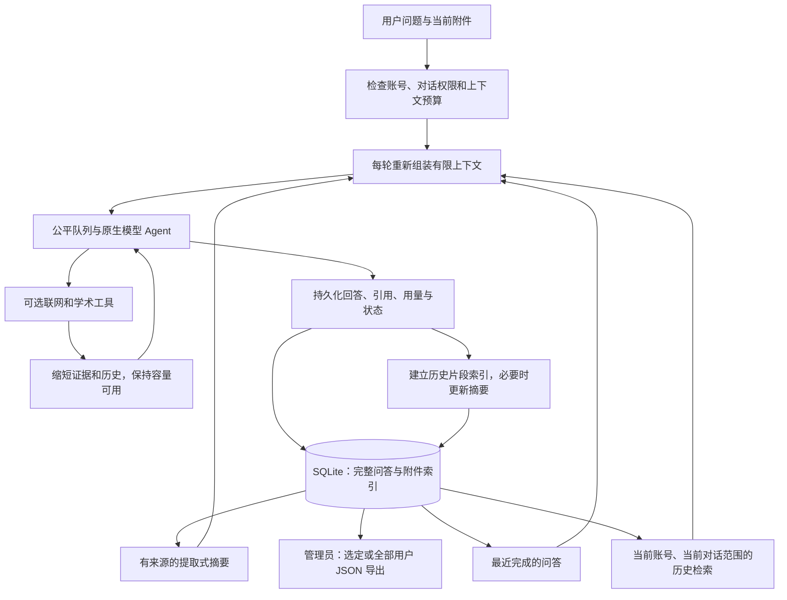

# 多轮对话记忆与用户数据导出

本方案已接入 8920 正式版。完整记录存储和模型上下文分开管理：保存完整记录不代表每次都把全部历史发送给模型。无需修改模型服务或增加外部数据库、Embedding API。

## 数据流



## 保存、检索和压缩

- `jobs.turn` 是完整档案，包含用户问题、模型回答、接口返回的思考内容、引用、工具记录、附件元信息和本轮记忆使用情况。生成中定期落盘，结束保存最终状态；关闭浏览器不会中断任务。
- `memory_chunks` 将已完成问答和解析后的文档切成约 700 字符、80 字符重叠的片段，记录账号、对话、原始任务、附件及字符位置。只索引最终回答和用户资料，不把思考过程或原始搜索结果反复放进下一轮。
- `memory_search` 使用 SQLite FTS5/BM25。中文采用连续双字片段，英文采用单词/编号，支持跨中英文原文关键词检索；**这是本地词法 RAG，不是向量语义检索，也不自动翻译检索词**。语义改写较大、跨语言同义词或完全不重合的表述可能漏检，应在问题中补充项目名/编号/关键词。联网搜索的双语工具机制保持原样。
- 检索 SQL 同时限定 `user_id` 和 `conversation_id`，先限定范围再选取结果。新对话不继承其他对话；普通账号无法检索别人的记录。
- `memory_summaries` 保存摘要版本、来源任务编号、时间和 token 估算。当前摘要提取最近最多 60 个已完成轮次中的用户条件、参数、更正等原句，优先最新内容，不让模型凭空概括。最新回答可通过最近问答和 RAG 进入上下文。
- 每次摘要都从原始记录重建，**不对上一次摘要不断再摘要**。摘要长度受硬上限约束。早期细节可能不在摘要中，但完整问答及检索索引仍保留，不因压缩删除。
- 正常完成后建立索引；若进程在索引阶段中断，下一次需要历史的问答会从原始记录补建。升级前的正式版历史也会自动补建。失败/中止轮次保留在档案，但不作为已完成答案参与记忆检索。

## 用户选择

输入框的记忆按钮提供：

| 选项 | 本轮行为 |
| --- | --- |
| 智能记忆（默认） | 最近问答＋一次本地历史检索＋容量允许的已有摘要 |
| 最近对话 | 最近问答和容量允许的已有摘要，不检索旧片段 |
| 仅当前问题 | 当前问题和所选附件；不读取历史、摘要和历史图片；仍保存本轮记录 |
| 自动压缩历史 | 历史超出记忆预算的触发比例时重建摘要；可关闭 |
| 立即整理记忆 | 手动重建摘要，不删除档案，不调用模型；该对话生成时禁用 |

关闭自动压缩只是停止自动生成摘要，容量保护始终生效：最近轮数、RAG 数量和实际 token 预算仍会限制进入模型的内容。页面会说明近期轮数、检索片段数、起始记忆估算和是否使用摘要；工具执行过程中再次缩减历史会另外提示。

当前附件正常使用原生解析/多模态通道。连续模式下，没有新附件时可沿用**紧接上一轮显式上传的图片**；更早图片请重新附上，避免在每轮无限重复图片 token。历史文档可检索服务器保留的解析文本，包括初次问答中未选入的后部片段；不代表完整文档每次都被模型读取。

## 上下文预算

| 参数 | 新建配置默认值 | 说明 |
| --- | ---: | --- |
| 模型上下文 | 32,768 | 必须与服务端真实窗口一致 |
| 常规输出上限 | 8,192 | 与输入共同占上下文 |
| 最近问答上限 | 4 轮 | 已有管理员配置保留原值；并非保证全部塞入 |
| 历史记忆预算 | 6,144 | 实际可用不足时继续缩小 |
| 摘要上限 | 1,024 | 有限摘录，原始记录保留 |
| 历史检索片段 | 最多 6 处 | 去重并按预算选取，可能少于 6 |
| 压缩触发比例 | 0.8 | 历史长度保守估算超过有效记忆预算的 80% |
| 指令/协议预留 | 2,048 | 初次组装的额外预留 |
| 开启联网额外预留 | 4,096 | 为后续搜索证据留空间 |

组装时先保护当前问题和附件、输出额度及协议预留，剩余容量才分给历史。使用保守估算而非真实 tokenizer 计数（中文约 1.5 token/字符、ASCII 约 1 token/3 字符、每图预留 6,144）；图片不会调用 `/tokenize`，避免已发现的服务端图像缓存问题。

联网后，既有 Agent 容量控制会重新估算全部消息：压缩搜索片段、按来源完整地移除历史片段，必要时减少输出，再对服务端上下文拒绝进行一次恢复重试。历史截减回调只操作本任务生成的历史前缀，保留当前问题、图片、工具调用配对及来源编号，不重新执行已经完成的搜索。上游实际 tokenizer 与估算仍可能有差异，不能保证任意输入都能容纳。

若**仅当前问题/附件本身**已过长，在入队和扣额度前明确提示拆分附件、减少图片或降低输出上限；历史压缩不能解决这种情况。

这不增加模型窗口，不提供无限记忆，也不保证每次找回所有旧事实。重要约束可在当前问题重申。记忆中的旧答案可能错误或过时，涉及最新政策/研究仍应启用联网核实。

## 管理员 JSON 导出

入口：系统管理 → 数据导出。

- 可以按姓名、邮箱、机构筛选并勾选多个用户，点击“导出所选用户”；也可直接“导出全部用户”。筛选列表不会改变已经勾选的用户。
- 包含活跃/停用用户和已从历史列表移除的对话。生成中的任务取导出时的数据库快照。
- 默认附带解析文本和规范化 JPEG 图片的 Base64，取消后导出元信息，同时省略附件索引片段正文。回答中已引用的附件内容仍属于回答档案。
- 原始 Office/PDF 二进制文件本来未被附件模块保留，无法从 JSON 还原原始排版；图片为服务器规范化 JPEG，不是上传前的原始图像。这是用户业务数据导出，不替代完整服务器备份。
- 不读取/导出密码与散列、登录 Cookie/会话、验证码、加密 API 密钥、管理员模型配置、内部请求上下文缓存。导出权限在后端验证，仅管理员可用，并写入审计记录。
- 在 SQLite 一致性读事务中逐用户、逐对话、逐记录写入私有临时文件，图片分块编码；完成后下载，不将全库 JSON 一次性加载进服务内存。下载后删除临时文件，超过 24 小时的遗留导出在下次导出时清理。页面先生成文件，再点击“下载 JSON 文件”走浏览器原生下载，不使用前端 Blob 缓冲全量数据。下载入口限定生成该文件的管理员，有效期一小时，下载后删除；大型导出仍建议分用户操作。

文件结构（示意）：

```json
{
  "manifest": {"schema":"wuyu-user-data","version":1,"scope":"selected","user_count":1},
  "users": [{
    "profile": {"id":"示例ID","email":"user@example.test","name":"示例用户"},
    "conversations": [{
      "conversation": {"id":"对话ID","title":"项目讨论","deleted":0},
      "turns": [{"task":{"id":"任务ID","status":"complete"},"conversation_turn":{"user":"问题","answer":"回答"}}],
      "memory_preferences": {"mode":"auto","auto_compress":true},
      "memory_summaries": [],
      "memory_chunks": []
    }],
    "attachments": []
  }]
}
```

## 云端部署与后续扩展

本版继续使用 SQLite WAL 和单实例调度，不增添云端运维依赖。服务器数据目录需要持久化卷、受控访问及备份；同时备份数据库、vault.key 和 uploads。升级只增加表和配置项，保留原用户、密码和对话。

如果未来多实例或数据量显著增加，再将 jobs/用户/记忆迁移到 PostgreSQL，生成任务放入统一队列，附件存对象存储。需要更强语义召回时可增加中英多语 Embedding + pgvector + 词法混合排序，仍必须在服务端固定账号/对话过滤。当前未实现这些外部服务，避免提前引入额外成本和维护。

## 验证

当前新增检查覆盖：152 轮长对话召回、上下文预算、提取式摘要版本与原文保留、停止自动摘要、账号/对话隔离、历史文档后部检索、仅当前问题、手动整理权限、图片连续问答、工具增长后二次压缩、管理员选定/全部导出、停用/已移除数据、附件内容和密钥排除。全部使用临时数据库与模拟模型，不调用真实模型接口。真实召回效果、实际 tokenizer 余量和多用户性能仍需在模型测试结束后，用你们的业务问答验证。
